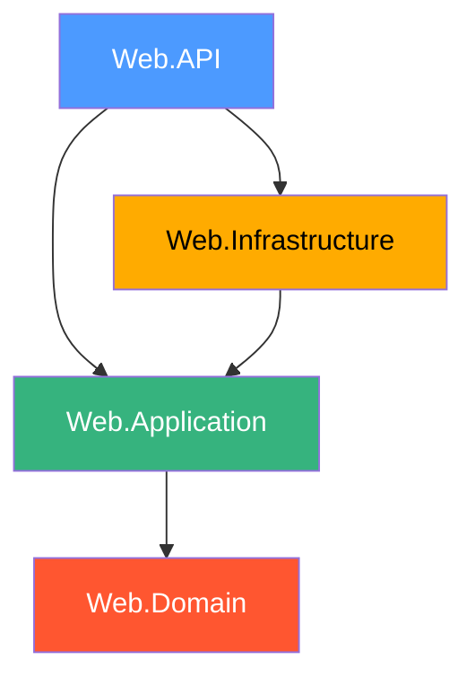
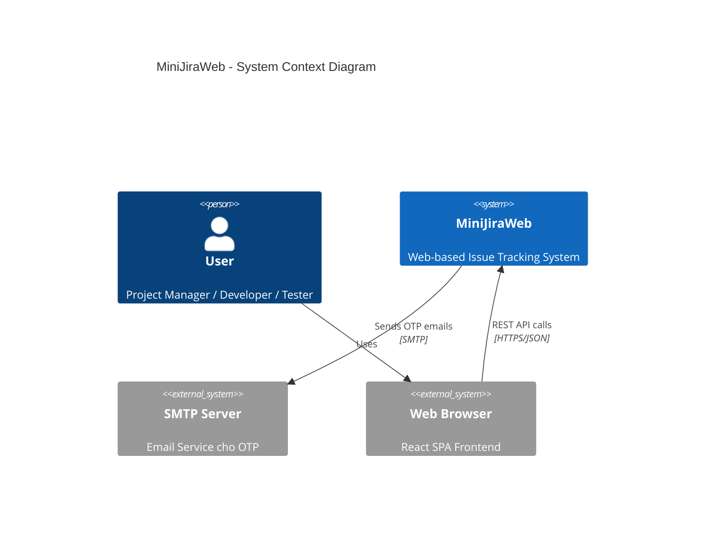
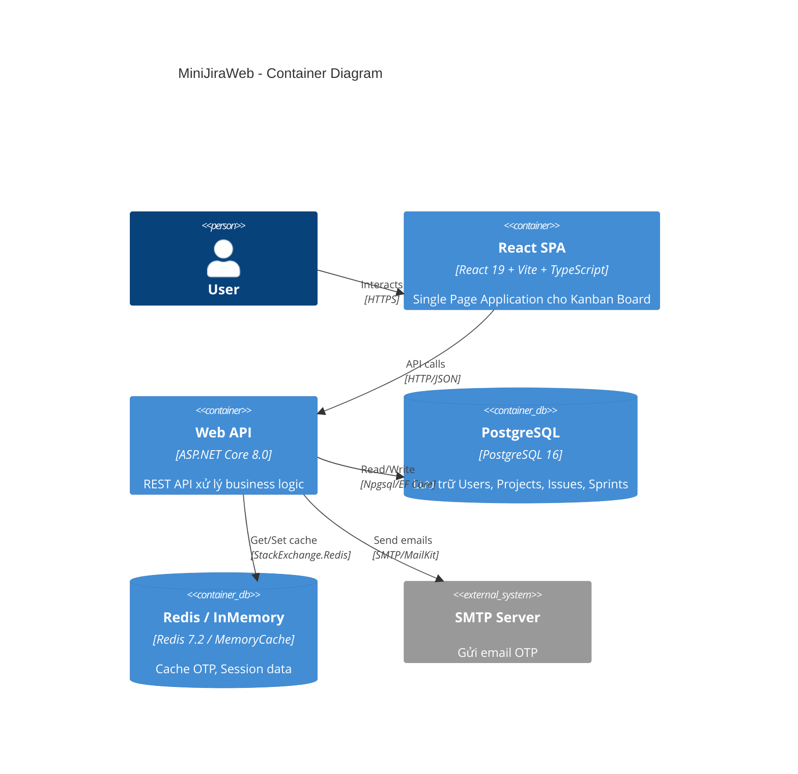
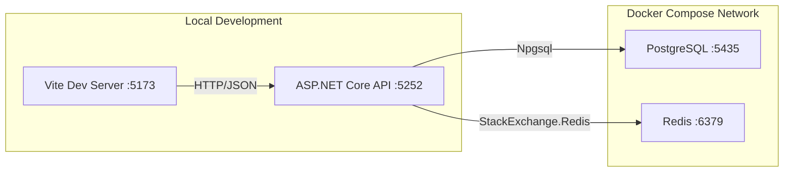

# MiniJiraWeb — Architecture Documentation

> **Ngày phân tích:** 2026-06-24  
> **Phiên bản phân tích:** v1.0  
> **Analyst:** AI Senior Software Architect

---

## 1. Tổng quan dự án

**MiniJiraWeb** là một ứng dụng quản lý dự án (Project Management / Issue Tracking) clone theo mô hình Jira, bao gồm:
- **Backend**: ASP.NET Core 8.0 Web API (.NET 8)
- **Frontend**: React 19 + TypeScript + Vite 8 + TailwindCSS 4
- **Database**: PostgreSQL 16 (via Docker)
- **Caching**: Redis 7.2 / InMemory (configurable)
- **Containerization**: Docker Compose

---

## 2. Loại Project

| Tiêu chí | Giá trị |
|---|---|
| **Loại** | Monolith (Modular Monolith hướng Clean Architecture) |
| **Repository** | Monorepo (backend + frontend cùng 1 repository) |
| **Backend** | 4 projects C# trong 1 solution |
| **Frontend** | Vite React SPA nằm trong folder `frontend/` |

---

## 3. Technology Stack

### 3.1 Backend

| Layer | Technology | Version |
|---|---|---|
| Framework | ASP.NET Core Web API | 8.0 |
| Language | C# | .NET 8 |
| ORM | Entity Framework Core | 8.0.0 |
| Database | PostgreSQL (Npgsql) | 16-alpine |
| Caching | Redis (StackExchange.Redis) / InMemory | 7.2-alpine |
| Mediator | MediatR | 14.1.0 |
| Mapping | AutoMapper | 16.1.1 |
| Validation | FluentValidation | 12.1.1 (registered, chưa implement) |
| Auth | JWT Bearer + BCrypt.Net | 8.0.0 / 4.2.0 |
| Email | MailKit | 4.16.0 |
| API Docs | Swagger (Swashbuckle) | 6.6.2 |

### 3.2 Frontend

| Technology | Version |
|---|---|
| React | 19.2.4 |
| TypeScript | 5.9.3 |
| Vite | 8.0.1 |
| TailwindCSS | 4.2.2 |
| Axios | 1.13.6 |
| Drag & Drop | @hello-pangea/dnd | 18.0.1 |
| Icons | lucide-react | 0.577.0 |

### 3.3 Infrastructure

| Component | Technology |
|---|---|
| Container Runtime | Docker Compose |
| Database | PostgreSQL 16-alpine (port 5435) |
| Cache | Redis 7.2-alpine (port 6379) |

---

## 4. Kiến trúc tổng thể — Clean Architecture

Dự án tuân theo **Clean Architecture** (Onion Architecture) với 4 layers rõ ràng:

```
┌─────────────────────────────────────────────┐
│           Web.API (Presentation)            │
│  Controllers, Middleware, Filters, Response  │
├─────────────────────────────────────────────┤
│        Web.Application (Use Cases)          │
│  Commands, Queries, DTOs, Interfaces        │
├─────────────────────────────────────────────┤
│          Web.Domain (Core/Entities)         │
│  Entities, Enums, Primitives, Interfaces    │
├─────────────────────────────────────────────┤
│     Web.Infrastructure (External Concerns)  │
│  EF Core, Services, Migrations, Templates   │
└─────────────────────────────────────────────┘
```

### 4.1 Dependency Flow (Project References)



| From | To | Reference Type |
|---|---|---|
| `Web.API` | `Web.Application` | ProjectReference |
| `Web.API` | `Web.Infrastructure` | ProjectReference |
| `Web.Infrastructure` | `Web.Application` | ProjectReference |
| `Web.Application` | `Web.Domain` | ProjectReference |

> **Quan sát:** `Web.Domain` là core layer, không phụ thuộc vào bất kỳ project nào khác. Đây là đúng nguyên tắc Clean Architecture.

### 4.2 C4 Model — Level 1: System Context



### 4.3 C4 Model — Level 2: Container Diagram



---

## 5. Pattern Architecture trong codebase

### 5.1 CQRS (Command Query Responsibility Segregation)

Dự án sử dụng **CQRS** thông qua MediatR:

| Pattern | Location | Example |
|---|---|---|
| **Commands** | `Web.Application/{Module}/Commands/` | `CreateIssueCommand`, `UpdateIssueStatusCommand` |
| **Queries** | `Web.Application/{Module}/Queries/` | `GetProjectBacklogQuery`, `GetSprintBoardQuery` |
| **Handlers** | Cùng file với Command/Query | `CreateIssueCommandHandler` |

> **Lưu ý:** CQRS ở đây là CQRS đơn giản (cùng database cho read/write), không phải Event Sourcing.

### 5.2 Result Pattern (Railway-Oriented Programming)

Dự án implement **Result Pattern** tùy chỉnh tại `Web.Domain/Primitives/`:

- `Result` — Cho operations không trả về data
- `Result<T>` — Cho operations trả về data
- `Error` — Value Object (record) chứa Code, Message, ErrorType
- Hỗ trợ **implicit operators** để syntax gọn

### 5.3 Repository Pattern — Không sử dụng

Dự án **KHÔNG** dùng Repository Pattern truyền thống. Thay vào đó, các handlers truy cập trực tiếp `IApplicationDbContext` (DbContext abstraction).

### 5.4 API Response Wrapper

`ApiResponse<T>` + `ResultExtensions` chuyển đổi `Result<T>` thành `IActionResult` phù hợp HTTP status codes:

| ErrorType | HTTP Status |
|---|---|
| Validation | 400 Bad Request |
| NotFound | 404 Not Found |
| Conflict | 409 Conflict |
| Unauthorized | 401 Unauthorized |

---

## 6. Separation of Concerns

| Layer | Trách nhiệm | Đánh giá |
|---|---|---|
| **Web.API** | HTTP concerns, routing, serialization, CORS, Swagger | ✅ Đúng |
| **Web.Application** | Business logic, use cases, DTOs, mapping | ✅ Đúng |
| **Web.Domain** | Domain entities, value objects, enums, domain interfaces | ✅ Đúng |
| **Web.Infrastructure** | Data access, external services, implementations | ✅ Đúng |

---

## 7. Deployment Architecture



> **Note:** API và Frontend chạy local, chỉ PostgreSQL và Redis chạy trong Docker.

---

## 8. Decision Records

| # | Decision | Rationale | Status |
|---|---|---|---|
| ADR-001 | Chọn Clean Architecture | Tách biệt concerns, testability, maintainability | ✅ Active |
| ADR-002 | MediatR cho CQRS | Decouple controllers khỏi business logic | ✅ Active |
| ADR-003 | Không dùng Repository Pattern | Giảm boilerplate, DbContext đã là Unit of Work | ✅ Active |
| ADR-004 | Switchable Cache (Redis/InMemory) | Linh hoạt dev/prod environment | ✅ Active |
| ADR-005 | BCrypt cho password hashing | Industry standard, work factor configurable (12) | ✅ Active |
| ADR-006 | JWT + Refresh Token | Stateless authentication, token rotation | 🚧 In Progress |
| ADR-007 | Device Fingerprinting | Multi-device security, giới hạn concurrent sessions | 🚧 In Progress |
| ADR-008 | OTP via Email | Email verification cho registration | 🚧 In Progress |
