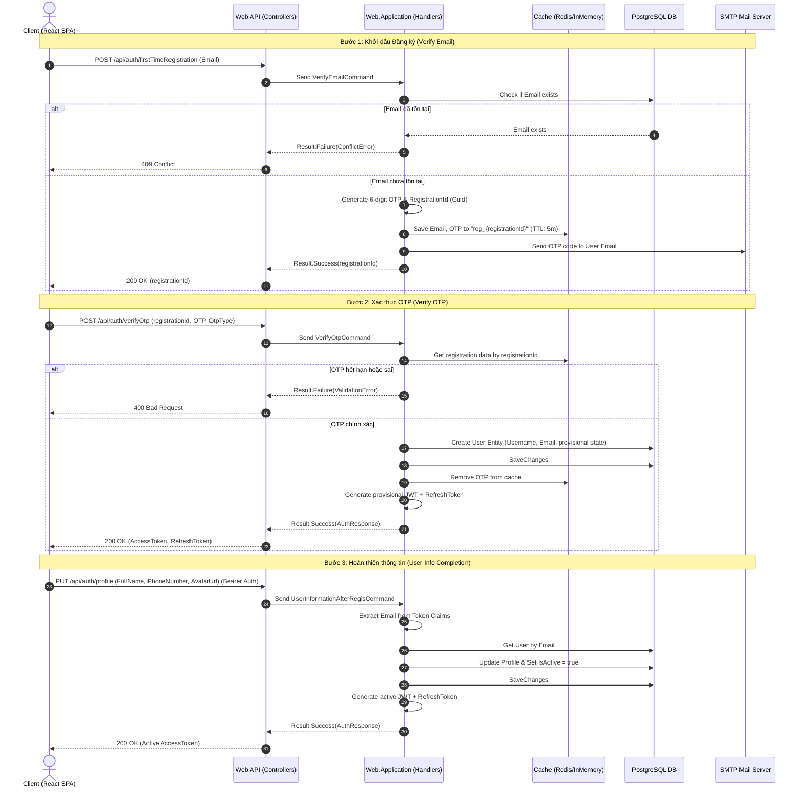
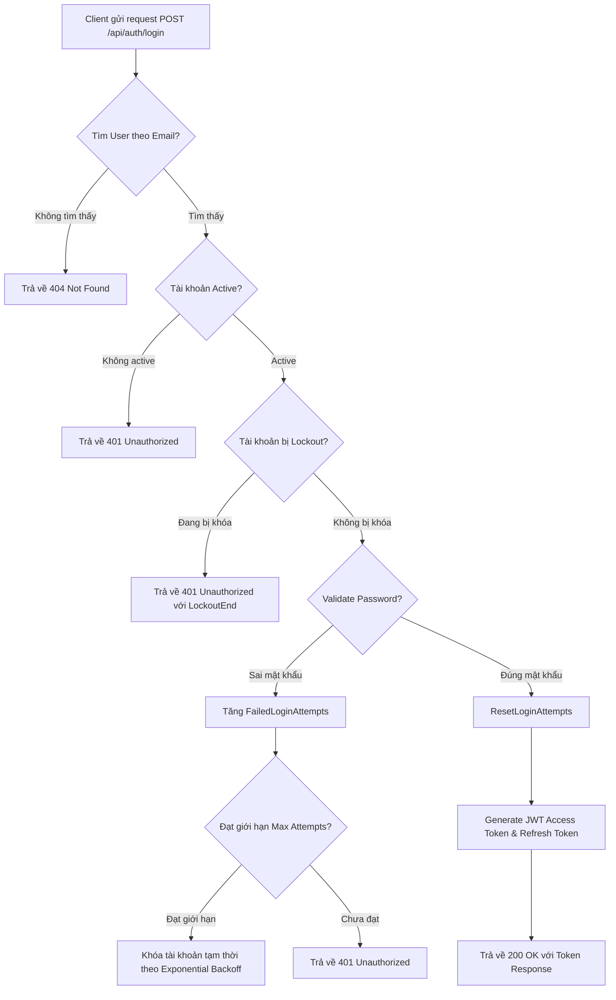
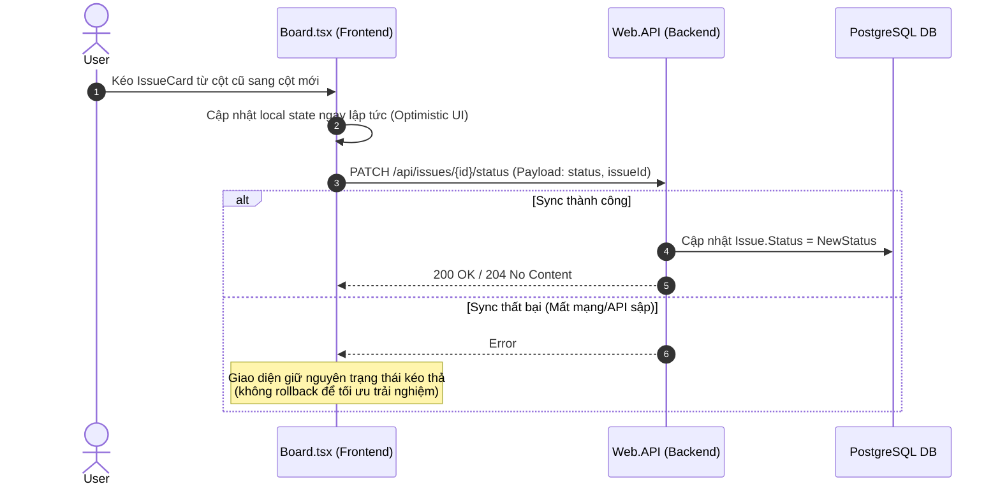

# MiniJiraWeb — Business Flow & Use Cases Documentation

> **Ngày phân tích:** 2026-06-24  
> **Phiên bản phân tích:** v1.0  

---

## 1. Luồng Xác thực và Đăng ký Tài khoản (Authentication & Registration Flow)

Mặc dù mã nguồn của phần Authentication hiện đang được tạm thời chú thích (`commented out`), tài liệu này mô tả chi tiết thiết kế nghiệp vụ của luồng xác thực đa bước có bảo mật OTP như dự án đã hoạch định.

### 1.1 Luồng Đăng ký tài khoản (Đăng ký ban đầu + Xác thực OTP + Hoàn thiện Profile)

---

### 1.2 Luồng Đăng nhập (Login Flow)

---

## 2. Luồng Nghiệp vụ Quản lý Công việc (Issue & Sprint Lifecycle)

Quản lý Issue tuân theo triết lý của Agile/Scrum hoặc Kanban, cho phép di chuyển Issue qua các trạng thái trên bảng Kanban.

### 2.1 Luồng Tạo mới Issue (Create Issue Flow)
1.  **Client** gửi yêu cầu `POST /api/issues` với payload chứa `Summary`, `Description`, `Type`, `Priority`, `ProjectId` và tùy chọn `SprintId`.
2.  **Web.API** tiếp nhận request và chuyển qua MediatR gửi `CreateIssueCommand`.
3.  **CreateIssueCommandHandler**:
    *   Tự động sinh mã `Key` của issue theo định dạng `{ProjectKey}-{Number}` (e.g., `PHX-23`).
    *   Kiểm tra sự tồn tại của `ProjectId`, `SprintId`, `AssigneeId` và `ReporterId` nếu được chỉ định.
    *   Lưu Issue mới vào database với trạng thái mặc định là `Backlog`.
    *   Trả về mã ID của Issue mới tạo.

### 2.2 Luồng Kéo thả trên Kanban Board (Drag-and-Drop / Update Issue Status Flow)
Kanban Board được tổ chức thành 5 cột tương ứng với các trạng thái của `IssueStatus`:
`Backlog` ➔ `To Do` ➔ `In Progress` ➔ `Review` ➔ `Done`.

### 2.3 Luồng Lập kế hoạch Sprint & Backlog (Sprint Planning & Backlog Flow)
*   **Backlog Query:** Khi người dùng xem phân đoạn Backlog, ứng dụng gọi `GET /api/issues/project/{projectId}/backlog`. Handler sẽ lọc ra các Issues của Project mà có `SprintId IS NULL`.
*   **Sprint Board Query:** Khi người dùng mở Active Sprint Board, ứng dụng gọi `GET /api/issues/sprint/{sprintId}/board`. Handler sẽ trả về danh sách các Issues được gán với `SprintId` tương ứng.
