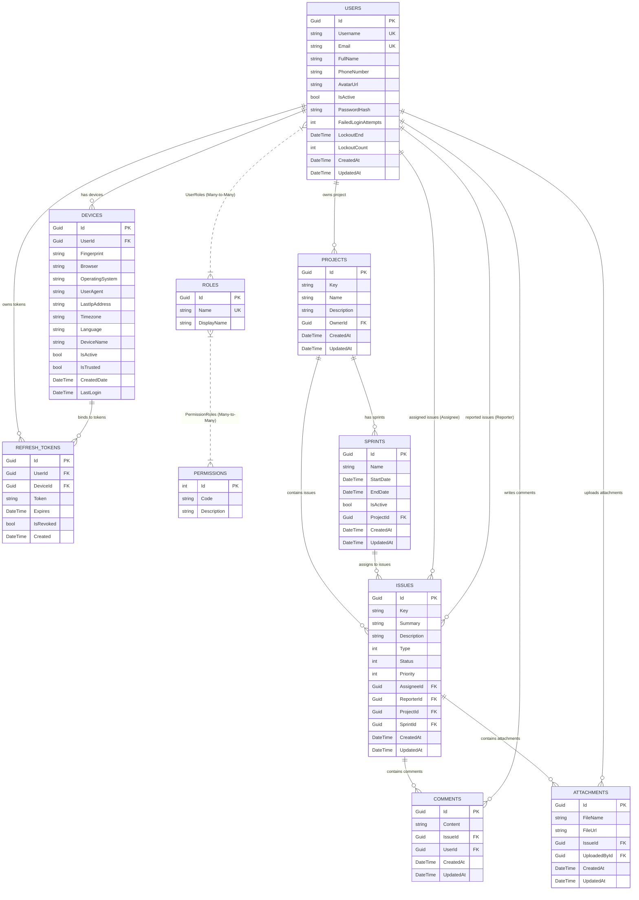

# MiniJiraWeb — Database Model Documentation

> **Ngày phân tích:** 2026-06-24  
> **Phiên bản phân tích:** v1.0  
> **Database Engine:** PostgreSQL 16  
> **ORM:** Entity Framework Core 8.0.0  

---

## 1. Tổng quan Database

Hệ thống sử dụng cơ sở dữ liệu quan hệ **PostgreSQL 16** chạy trong Docker container (port `5435`). Việc quản lý schema, khởi tạo và cập nhật cấu trúc database được thực hiện thông qua **Entity Framework Core Migrations** trong project `Web.Infrastructure`.

Trong môi trường Development, database sẽ tự động chạy migration khi ứng dụng khởi động (ở `Program.cs` thông qua `db.Database.Migrate()`).

---

## 2. Sơ đồ Quan hệ Thực thể (Entity-Relationship Diagram - ERD)

Dưới đây là sơ đồ ERD mô tả các thực thể chính của hệ thống MiniJiraWeb và mối quan hệ giữa chúng:

---

## 3. Chi tiết các bảng (Tables Metadata)

### 3.1 Nhóm Quản lý Hệ thống & Xác thực (Security & Identity)

#### Bảng `Users`
Lưu trữ thông tin chi tiết của người dùng cùng cơ chế bảo mật (Lockout, Password Hashing).
*   **Id** (Guid, PK): Khóa chính, sinh tự động (`Guid.NewGuid()`).
*   **Username** (varchar(256), Unique): Tên đăng nhập.
*   **Email** (varchar(256), Unique): Địa chỉ email dùng để định danh chính và nhận OTP.
*   **FullName** (varchar(256)): Tên hiển thị đầy đủ.
*   **PhoneNumber** (text, Nullable): Số điện thoại.
*   **AvatarUrl** (text, Nullable): Đường dẫn ảnh đại diện.
*   **IsActive** (boolean): Trạng thái hoạt động (mặc định `true`). Tài khoản bị khóa vĩnh viễn khi đạt giới hạn lockout.
*   **PasswordHash** (text, Nullable): Mật khẩu băm (dùng BCrypt).
*   **FailedLoginAttempts** (int): Số lần đăng nhập sai liên tiếp.
*   **LockoutEnd** (timestamp, Nullable): Thời điểm hết thời gian khóa tạm thời.
*   **LockoutCount** (int): Số lần tài khoản bị khóa tạm thời.

#### Bảng `Devices`
Quản lý thiết bị của người dùng phục vụ cho Multi-device Security và Fingerprinting.
*   **Id** (Guid, PK)
*   **UserId** (Guid, FK): Liên kết đến `Users(Id)` (Cascade Delete).
*   **Fingerprint** (text): Vân tay thiết bị được tạo bởi frontend (FingerprintJS).
*   **Browser** (text): Tên trình duyệt sử dụng.
*   **OperatingSystem** (text): Hệ điều hành.
*   **UserAgent** (text): Chuỗi User Agent gốc.
*   **LastIpAddress** (text, Nullable): Địa chỉ IP trong phiên làm việc cuối.
*   **Timezone** (text, Nullable): Múi giờ của thiết bị.
*   **Language** (text, Nullable): Ngôn ngữ hệ thống của thiết bị.
*   **DeviceName** (text, Nullable): Tên dễ nhớ của thiết bị (mặc định `{Browser} on {OperatingSystem}`).
*   **IsActive** (boolean): Trạng thái phiên đăng nhập của thiết bị.
*   **IsTrusted** (boolean): Người dùng đánh dấu thiết bị tin cậy.
*   **CreatedDate** (timestamp)
*   **LastLogin** (timestamp, Nullable)

#### Bảng `RefreshTokens`
Quản lý token gia hạn phiên làm việc và bảo vệ luồng Token Rotation.
*   **Id** (Guid, PK)
*   **UserId** (Guid, FK): Liên kết đến `Users(Id)` (Cascade Delete).
*   **DeviceId** (Guid, FK): Liên kết đến `Devices(Id)` (Cascade Delete).
*   **Token** (text): Refresh token ngẫu nhiên dạng Base64 (64 bytes).
*   **Expires** (timestamp): Thời gian hết hạn của token.
*   **IsRevoked** (boolean): Đã bị thu hồi hay chưa.
*   **Created** (timestamp): Thời gian tạo token.

#### Bảng `Roles`
*   **Id** (Guid, PK)
*   **Name** (varchar(256), Unique): Tên role định danh (e.g., `Admin`, `Member`).
*   **DisplayName** (varchar(256)): Tên role hiển thị cho người dùng.

#### Bảng `Permissions`
*   **Id** (int, PK)
*   **Code** (text): Mã code của permission (e.g., `CreateProject`, `DeleteIssue`).
*   **Description** (text): Mô tả chi tiết permission.

#### Bảng trung gian
*   **UserRoles**: Liên kết `Users(Id)` và `Roles(Id)` (Khóa chính kép `UserId`, `RoleId`, Cascade Delete).
*   **PermissionRoles**: Liên kết `Permissions(Id)` và `Roles(Id)` (Khóa chính kép `PermissionId`, `RoleId`, Cascade Delete).

---

### 3.2 Nhóm Quản lý Dự án & Công việc (Business Core)

#### Bảng `Projects`
*   **Id** (Guid, PK)
*   **Key** (text): Mã dự án viết tắt (e.g., `JIRA`, `PHX`).
*   **Name** (text): Tên dự án.
*   **Description** (text, Nullable)
*   **OwnerId** (Guid, FK): Liên kết đến `Users(Id)` (Restrict Delete - không cho phép xóa Owner nếu Project còn tồn tại).
*   **CreatedAt / UpdatedAt** (timestamp)

#### Bảng `Sprints`
*   **Id** (Guid, PK)
*   **Name** (text): Tên sprint (e.g., `Sprint 1`).
*   **StartDate** (timestamp): Ngày bắt đầu.
*   **EndDate** (timestamp): Ngày kết thúc.
*   **IsActive** (boolean): Trạng thái hoạt động của sprint.
*   **ProjectId** (Guid, FK): Liên kết đến `Projects(Id)` (Cascade Delete).

#### Bảng `Issues`
Lưu trữ thông tin chi tiết Task, Story, Bug hoặc Epic.
*   **Id** (Guid, PK)
*   **Key** (text): Mã issue (e.g., `PHX-123`).
*   **Summary** (text): Tiêu đề issue.
*   **Description** (text, Nullable): Mô tả chi tiết công việc.
*   **Type** (int): Loại issue (Mapped sang `IssueType` enum: `Task` = 0, `Story` = 1, `Bug` = 2, `Epic` = 3).
*   **Status** (int): Trạng thái issue (Mapped sang `IssueStatus` enum: `Backlog` = 0, `ToDo` = 1, `InProgress` = 2, `Review` = 3, `Done` = 4).
*   **Priority** (int): Độ ưu tiên (Mapped sang `IssuePriority` enum: `Lowest` = 0, `Low` = 1, `Medium` = 2, `High` = 3, `Highest` = 4).
*   **AssigneeId** (Guid, FK, Nullable): Liên kết đến `Users(Id)` (SetNull Delete - nếu User bị xóa, Issue sẽ trống Assignee).
*   **ReporterId** (Guid, FK): Liên kết đến `Users(Id)` (Restrict Delete - không cho phép xóa Reporter nếu Issue còn tồn tại).
*   **ProjectId** (Guid, FK): Liên kết đến `Projects(Id)` (Cascade Delete).
*   **SprintId** (Guid, FK, Nullable): Liên kết đến `Sprints(Id)` (SetNull Delete - nếu Sprint bị xóa, Issue sẽ quay về Backlog).

#### Bảng `Comments`
*   **Id** (Guid, PK)
*   **Content** (text): Nội dung comment.
*   **IssueId** (Guid, FK): Liên kết đến `Issues(Id)` (Cascade Delete).
*   **UserId** (Guid, FK): Liên kết đến `Users(Id)` (Cascade Delete).

#### Bảng `Attachments`
*   **Id** (Guid, PK)
*   **FileName** (text): Tên file.
*   **FileUrl** (text): Link tải file.
*   **IssueId** (Guid, FK): Liên kết đến `Issues(Id)` (Cascade Delete).
*   **UploadedById** (Guid, FK): Liên kết đến `Users(Id)` (Cascade Delete).

---

## 4. Ràng buộc & Cơ chế Xóa (Cascading & Constraints)

EF Core Fluent API định nghĩa chính xác hành vi xóa dữ liệu (OnDelete behavior) để đảm bảo tính toàn vẹn tham chiếu trong PostgreSQL:

| Mối quan hệ | Cấu hình trong DbContext | Hành vi khi bản ghi cha bị xóa |
|---|---|---|
| `Project -> Owner` | `.OnDelete(DeleteBehavior.Restrict)` | 🚫 Chặn xóa User nếu họ là chủ sở hữu của bất kỳ Project nào. |
| `Project -> Sprints` | `.OnDelete(DeleteBehavior.Cascade)` | 🗑️ Xóa sạch tất cả Sprint của Project đó. |
| `Project -> Issues` | `.OnDelete(DeleteBehavior.Cascade)` | 🗑️ Xóa sạch tất cả Issue của Project đó. |
| `Sprint -> Issues` | `.OnDelete(DeleteBehavior.SetNull)` | 🔄 Đưa trường `SprintId` của tất cả Issue liên quan về `NULL` (quay về Backlog). |
| `Issue -> Assignee` | `.OnDelete(DeleteBehavior.SetNull)` | 🔄 Đưa trường `AssigneeId` về `NULL`. |
| `Issue -> Reporter` | `.OnDelete(DeleteBehavior.Restrict)` | 🚫 Chặn xóa User nếu họ là Reporter của bất kỳ Issue nào. |
| `Issue -> Comments` | `.OnDelete(DeleteBehavior.Cascade)` | 🗑️ Xóa sạch tất cả comment gắn liền với Issue đó. |
| `Issue -> Attachments`| `.OnDelete(DeleteBehavior.Cascade)` | 🗑️ Xóa sạch tất cả file đính kèm gắn liền với Issue đó. |
| `User -> Devices` | `.OnDelete(DeleteBehavior.Cascade)` | 🗑️ Xóa sạch tất cả thông tin thiết bị đã đăng nhập của User. |
| `User -> RefreshTokens`| `.OnDelete(DeleteBehavior.Cascade)`| 🗑️ Xóa sạch tất cả Refresh Token liên quan. |

---

## 5. Chiến lược tối ưu & Truy vấn (Query & Caching Patterns)

1.  **Chỉ mục (Indexes):**
    *   `Users`: Unique Index trên `Username` và `Email` để tăng tốc truy vấn đăng nhập và xác thực đăng ký trùng lặp.
    *   `Roles`: Unique Index trên `Name`.
2.  **No-Tracking Query:**
    *   Đối với các handlers dạng truy vấn thông tin (Queries), sử dụng `.AsNoTracking()` (hoặc cấu hình tự động thông qua AutoMapper mapping trực tiếp) để tránh lưu trữ tracking state trong Memory của EF Core, tối ưu hiệu năng đọc.
3.  **Caching Strategy:**
    *   **InMemory Cache:** Dùng mặc định khi chạy development local qua class `InMemoryCacheService`.
    *   **Redis Cache:** Đăng ký qua class `RedisCacheService` khi chuyển cấu hình Provider trong `appsettings.json` sang `"Redis"`.
    *   **Dữ liệu Cache:** OTP đăng ký (key: `otp_{OtpType}_{registrationId}`) tồn tại trong 5 phút. Khi người dùng nhập OTP chính xác, OTP cache bị xóa ngay để tránh replay attack.
